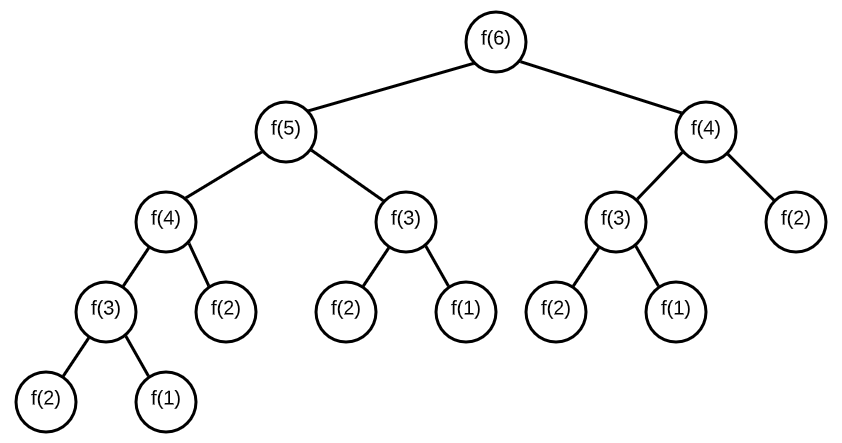
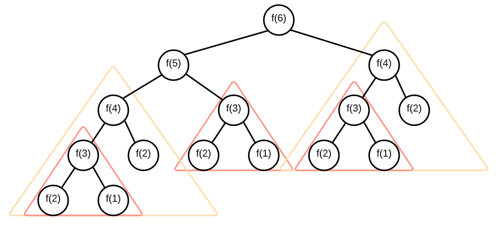
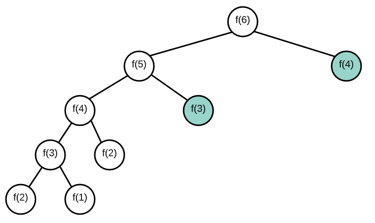

### Memoization

  What is memoization? It follows one paradigm of functional programming; 1-1 input to output ratio. Thus, we can store results of a function so we can use it later on. This way, if we hit a recursive case where we've already calculated that value, we don't have to duplicate our results again.

  We'll use memoization for recursion.

I'll be working out of `../Algorithms/explore_memoization.js` and comparing code here.

#### Ex 1: Non-memoized Factorial
We have a non-memoized version of our factorial here:

```js
function factorial(n) {
  if (n === 1) return 1;
  return n * factorial(n - 1);
}
```

If we run our benchmarks, we get stuff like: 

```js
consoleHeader("Non-Memoized Factorial");
/*
################################################################################
#                            Non-Memoized Factorial                            #
################################################################################
*/
benchmark(factorial(6), "factorial(6)");  // => 720, requires 6 calls, time: 0.246ms
benchmark(factorial(6), "factorial(6) again");  // => 720, requires 6 calls, time: 0.043ms
factorial(5) // 120, 5 calls, time: 0.023ms
factorial(7) // 5040, time: 0.059ms

```
  Basically, it's still a little bit slow. Running factorial(6), 5, then 7 all take about .02 - .06 seconds.

  Memoization will let us speed things up the seond time.

```js

let memo = {} // object to store prior results
function memFactorial(n) {
  // base cases:
  if (n in memo) return memo[n]; // fetch stored results in memo if already there
  if (n === 1) return 1;

  // Non base cases: Store into memo, then retrieve from memo
  memo[n] = n * memFactorial(n - 1);
  return memo[n] // O(1) in JS
}

/*
################################################################################
#                              Memoized Factorial                              #
################################################################################
*/
// timeStart and timeEnd were horribly inaccurate when testing on larger inputs...
benchmark(memFactorial(6), "memoized factorial(6)");       // => 720, requires 6 calls
benchmark(memFactorial(6), "memoized factorial(6) AGAIN 1");       // => 720, requires 1 call
benchmark(memFactorial(6), "memoized factorial(6) AGAIN 2");       // => 720, requires 1 call
benchmark(memFactorial(5), "memoized factorial(5)");       // => 120, requires 1 call
benchmark(memFactorial(7), "memoized factorial(7)");       // => 5040, requires 2 calls

```

  We have done some slight improvements. However, we haven't reduced our function by an order of magnitude. It was originally O(n), and still is in the worst case when it's invoked for the first time. Additionally, we have a global variable `memo`, so we could do better.

  The first time we run memFactorial(6), our `memo` is actually:
```js
{ '2': 2, '3': 6, '4': 24, '5': 120, '6': 720 }
```
  and that is why subsequent calls speed up execution.

```js
/*
################################################################################
#                          Improved Memoized Fibonacci                         #
################################################################################
*/
```

What is the time complexity of the standard fibonacci sequence?

Fibonacci:
```js
function fib(n) {
    if (n === 1 || n === 2) return 1;
    return fib(n - 1) + fib(n - 2);
}
```

If we view this as a tree:




  We can see that there are roughly 2 children per node. f(6) at the top has 2 nodes, and each of the children below that has 2 children as well. So this is roughly 2^6 or 2^n in run time; we have an exponential time complexity!

Where can we shave off some duplications?



We can avoid going over duplicate trees via memoization.

Code:

```js
function memFib(n, memo = {}) {
  // base cases:
  if (n in memo) return memo[n];
  if (n === 1 || n === 2) return 1;

  memo[n] = memFib(n - 1, memo) + memFib(n - 2, memo);
  return memo[n];
}
```
Note: We were able to store memo as an object within the function and not as a global variable! The memo gets initialized in the top level when it is first invoked, and because in JS, arrays and objects are referenced, we don't have to worry about the global scope.

Which nodes have been removed?


Now, because the tree only branches on the left side, we only need to explore a subtree fully once. We won't double check `fib(3)` or anything higher more than once. In fact, we have achieved linear run time, O(n).

**Let's compare (2 reps is clearly not enough for a benchmark but whatever...)**

| nonMem | Mem |
|------- | --- |
| |  |

| Input 	| fib(Input)  	| memFib(Input) 	|
|-------	|-------------	|---------------	|
| 6     	| 0.295ms     	| 0.537ms       	|
| 6     	| 0.156ms     	| 0.111ms       	|
| 30    	| 21.149ms    	| 0.091ms       	|
| 30    	| 8.067ms     	| 0.197ms       	|
| 45    	| 10845.889ms 	| 0.075ms       	|
| 45    	| 13513.034ms 	| 0.080ms       	|

Clearly, memoization helped quite a bit.

<details> 
<summary> Code snippets </summary>

Nonmemoized:
```js
consoleHeader("Fibonacci");
benchmark(() => fib(6), "fib(6) Rep 1");
benchmark(() => fib(6), "fib(6) Rep 2");
benchmark(() => fib(30), "fib(30) Rep 1");
benchmark(() => fib(30), "fib(30) Rep 2");
benchmark(() => fib(45), "fib(45) Rep 1");
benchmark(() => fib(45), "fib(45) Rep 2");
```
Memoized:
```js
consoleHeader("Memoized Fib");
benchmark(() => memFib(6), "memFib(6) Rep 1");
benchmark(() => memFib(6), "memFib(6) Rep 2");
benchmark(() => memFib(30), "memFib(30) Rep 1");
benchmark(() => memFib(30), "memFib(30) Rep 2");
benchmark(() => memFib(45), "memFib(45) Rep 1");
benchmark(() => memFib(45), "memFib(45) Rep 2");
```

</details>


### Memoization video lectures and Take home message

  Same code, but throws in useful console logs to let you know if you are triggering a retrieval from the memo object.


  Take home message:

You have to conceptually understand why your code is inefficient. If you know it's inefficient due to some repetitive, you can duplicate it. 
Memoization is formulaic, and all you are doing is creating an object to store results, and return them if it's in the object you made. It's easy.
Worry about your own current stack frame. If you try to memoize another frame, you may duplicate keys in your tree, which defeats the purpose and efficiency of memoization.