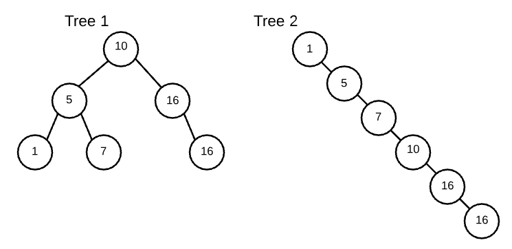

Following: https://open.appacademy.io/learn/full-stack-online/data-structures-and-algorithms/binary-search-tree-notes

### What is a Binary Search Tree?

A Binary Search Tree is a binary tree, where:
  - values in left subtree must all be less than node's given value
  -  values in right subtree >= node's value

**A recursivel definition**

   - the left subtree contains values less than the root
   - right subtree contains values >= root
   - left subtree is a BST
   - right subtree is a BST

  And base cases:
  - A tree with 0 nodes is a BST.

**Examples**


### What makes BSTs important?

  They're sorted, and can get the order via our print in order function (from trees p_03).

### Naive BST Implementation
  We define BST by defining a naive insert. It always recursively progresses down, and doesn't bubble up or down (like a heap).

<details>
<summary>Naive BST Code</summary>

```js
class TreeNode {
  constructor(val) {
    this.val = val;
    this.left = null;
    this.right = null;
  }
}

class BST {
  constructor() {
    this.root = null;
  }

  insert(val, root=this.root) {
    // If there is no root, make this val the new root
    if(!this.root) {
      this.root = new TreeNode(val);
      return;
    }
    
    if (val < root.val) { // If the val < root, place on left side
      if (!root.left) { // nothing on left side yet
        root.left = new TreeNode(val);
      } else { // call again recursively moving down a level on left side
        this.insert(val, root.left);
      }
    } else { // val > root, so place on right side
      if (!root.right) {
        root.right = new TreeNode(val)
      } else {
        this.insert(val, root.right);
      }
    }

  }
}
```

</details>

#### Why does this matter? 
  The order in which we insert values into our BSTs will make a difference.
We'll create a tree with the following values: 1, 5, 7, 10, 16, 16


<style type="text/css">
.tg  {border-collapse:collapse;border-spacing:0;}
.tg td{font-family:Arial, sans-serif;font-size:14px;padding:10px 5px;border-style:solid;border-width:1px;overflow:hidden;word-break:normal;border-color:black;}
.tg th{font-family:Arial, sans-serif;font-size:14px;font-weight:normal;padding:10px 5px;border-style:solid;border-width:1px;overflow:hidden;word-break:normal;border-color:black;}
.tg .tg-cly1{text-align:left;vertical-align:middle}
</style>
<table class="tg">
  <tr>
    <th class="tg-cly1"><b>tree 1: </b>10, 5, 16, 1, 7, 16</th>
    <th class="tg-cly1"><b>tree 2: </b>1, 5, 7, 10, 16, 16</th>
  </tr>
  <tr>
    <td class="tg-cly1">
<pre>
<code>
let tree1 = new BST();
tree1.insert(10);
tree1.insert(5);
tree1.insert(16);
tree1.insert(1);
tree1.insert(7);
tree1.insert(16);
</code>
</pre>
    </td>
    <td class="tg-cly1">
<pre><code>
let tree2 = new BST();
tree2.insert(1);
tree2.insert(5);
tree2.insert(7);
tree2.insert(10);
tree2.insert(16);
tree2.insert(16);
</code>
</pre>
    </td>
  </tr>
</table>

And we get two different trees:

