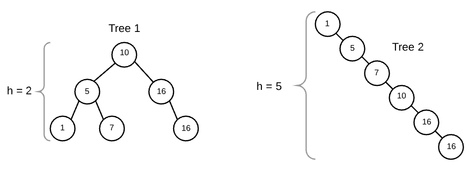

### Binary Search on BSTs

We can use Binary Search Trees for our Binary Search algorithm (which requires a sorted array).
And because Binary Search trees are sorted already, we should be able to implement a search function quickly.

Trees are great at handling recursion, and because binary search is recursive, this binary search tree will make it easier to implement a binary search.

The code is in `p_02a_bst_search.js`

### Height Balance and Time Complexity

  Height is defined as the number of edges between the root and farthest leaf.
  So a single-node tree has a height of 0, and an empty tree a height of -1.

**balance definition:**
A balanced binary tree is a tree where the left and right subtrees differ in height by 1 at most, and left and right sub-trees are both balanced.

Height and Balance matter, because a balanced tree means we travel minimally.

Here are two BSTs with the same value, but different heights/balance

### Performance:

For binary trees, because each tree has 2 nodes, it's log2(n)

|                    	| balanced  	| unbalanced 	|
|--------------------	|-----------	|------------	|
| time               	| O(log(n)) 	| O(n)       	|
| space (memory)     	| O(1)      	| O(1)       	|
| space (call stack) 	| O(log(n)) 	| O(n)       	|

To reduce our call stack further, we'll need to proceed iteratively (tabulation?)