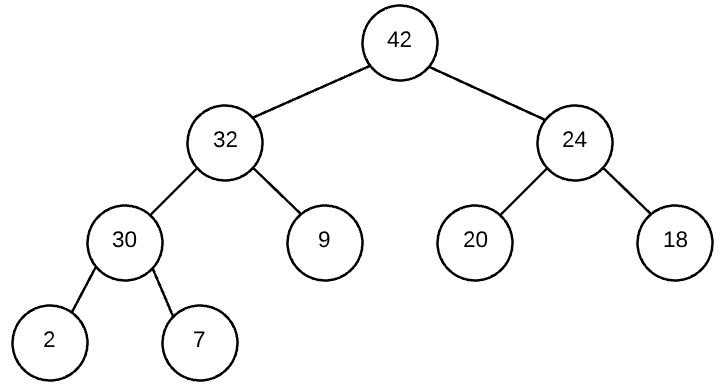

### How can we implement heaps?

Heaps can be implemented using an array and carefully indexing them.

For example, the following heap, <br>


can be represented as:
```js
[null, 42, 32, 24, 30, 9, 20, 18, 2, 7]
```

How do we get find children or the general structure via indexing?
  * index `i` represents a node
  * node `i`'s left child: `2i`
  * node `i`'s right child: `2i+1`

Code:

```js
class MaxHeap {
    constructor() {
        this.array = [null];
    }

    getParent(idx) {
        return Math.floor(idx / 2);
    }

    getLeftChild(idx) {
        return idx * 2;
    }

    getRightChild(idx) {
        return idx * 2 + 1;
    }

    // ...
}

```

### How do we insert?
We'll need a method to add a new value into the heap without breaking our heap property.

```js

class MaxHeap {
  // ...
  insert(val) {
    this.array.push(val); // bottom far left...

    // sift value up.
    this.siftUp(this.array.length - 1);
  }

  siftUp(idx) {
    // if we're at root
    if (idx === 1) return;

    // Else, find the parent index to swap if needed.
    let parentIdx = this.getParent(idx);

    if ( this.array[idx] > this.array[parentIdx] ){
      // swap node with parent
      [ this.array[parentIdx], this.array[idx] ] = [ this.array[idx], this.array[parentIdx] ];
    }

    // keep sifting up until thing is in place/
    this.siftUp(parentIdx);

  }
}
```

### How do we delete?

```js

class MaxHeap() {
  deleteMax() {
    // base cases:
    if (this.array.length === 2) return this.array.pop(); // 1st ele null...
    if (this.array.length === 1) return null; // no ele: return nothing

    


  }

}
```